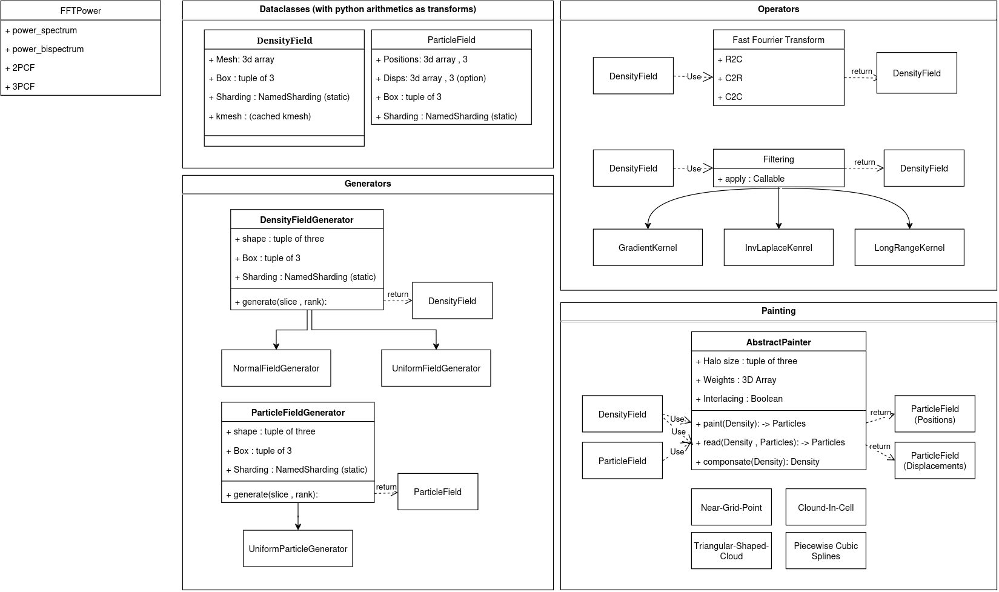

# Design Document for pmesh-jax

This document outlines the design and structure of the pmesh-jax library.

## High-Level Components

### 1. **Dataclasses**
   - **DensityField**: Represents 3D density fields with attributes for the mesh, box size, and optional kmesh cache.
   - **ParticleField**: Stores particle positions, optional displacements, and box metadata.

### 2. **Generators**
   - **DensityFieldGenerator**: Creates density fields based on input parameters, extended to:
     - **NormalFieldGenerator**: Generates fields with normal distributions.
     - **UniformFieldGenerator**: Generates uniform fields.
   - **ParticleFieldGenerator**: Creates particle fields, extended to:
     - **UniformParticleGenerator**: Produces uniform particle distributions.

### 3. **Operators**
   - **Fast Fourier Transform (FFT)**: 
     - Operations include `R2C`, `C2R`, and `C2C` for density fields.
   - **Filtering**: Applies filters like:
     - **GradientKernel**
     - **InvLaplaceKernel**
     - **LongRangeKernel**

### 4. **Painting**
   - **AbstractPainter**: Converts density fields to particle fields using methods such as:
     - **Near-Grid-Point**
     - **Cloud-In-Cell**
     - **Triangular-Shaped-Cloud**
     - **Piecewise Cubic Splines**

### 5. **Statistics**
   - **FFTPower**: Provides functionality for computing:
     - Power spectrum
     - Bispectrum
     - 2-point correlation function (2PCF)
     - 3-point correlation function (3PCF)

## Diagram

The overall system architecture is illustrated in the following diagram:

